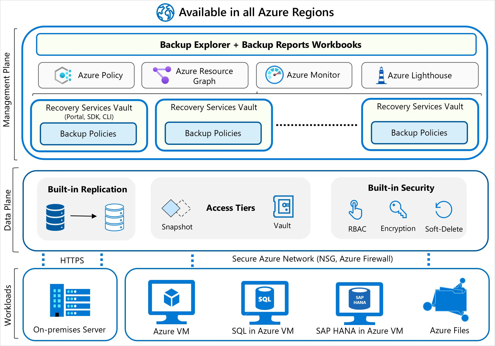

# Backup

## Backup locations
1. Azure Backup stores the backed-up data in Recovery Services vaults and Backup vaults.
2. For on-premises Windows machines, you can back up directly to Azure with the Azure Backup Microsoft Azure Recovery Services (MARS) agent. Alternatively, you can back up these Windows machines to a backup server, perhaps a System Center Data Protection Manager (DPM) or Microsoft Azure Backup Server (MABS). You can then back that server up to a Recovery Services vault in Azure.
3. In UI, this is called **Backup Center**. Backup center allows you to have a single pane of glass to manage all tasks related to backups. Backup center is designed to function well across a large and distributed Azure environment. You can use Backup center to efficiently manage backups spanning multiple workload types, vaults, subscriptions, regions, and Azure Lighthouse tenants.

## Method

1. Workload integration layer - Backup Extension: Integration with the actual workload, such as Azure virtual machines (VMs) or Azure Blobs, happens at this layer.
2. Data Plane - Access Tiers: There are three access tiers where the backups could be stored:
    - Snapshot tier - The snapshot is taken and stored along with the disk.
    - Standard tier - Backup data for all workloads supported by Azure Backup is stored in vaults, which hold backup storage, an autoscaling set of storage accounts managed by Azure Backup.
    - Archive tier - The backup data is moved to an offline state in the archive tier. Azure Backup for storing backup data, including their Long-Term Retention (LTR) backup data, with retention needs defined in the organization's compliance rules. 
3. Data Plane - Availability and Security: The backup data is replicated across zones or regions, based on the redundancy the user specifies.
4. Management Plane – Recovery Services vault/Backup vault and Backup center: The vault provides an interface for the user to interact with the backup service.

## RTO
Recovery Time Objective (RTO) is the target time within which a business process must be restored after a disaster occurs to avoid unacceptable consequences. For instance, if a critical application goes down due to a server failure and the business can only tolerate a maximum of four hours of downtime, then the RTO is four hours.

## RPO
Recovery Point Objective (RPO) is the maximum amount of data loss, measured in time, that your organization can sustain during an event.

## Azure Backup can provide backup services for the following data assets:

- On-premises files, folders, and system state
- Azure Virtual Machines (VMs)
- Azure Managed Disks
- Azure Files Shares
- SQL Server in Azure VMs
- SAP HANA (High-performance Analytic Appliance) databases in Azure VMs
- Azure Database for PostgreSQL servers
- Azure Blobs
- Azure Database for PostgreSQL - Flexible servers
- Azure Database for MySQL - Flexible servers
- Azure Kubernetes cluster

## Backup types

| Type | Description | Usage |
| --- | --- | --- |
| Full | A full database backup backs up the entire database. It contains all the data in a specific database or in a set of filegroups or files. A full backup also contains enough logs to recover that data. | At most, you can trigger one full backup per day. You can choose to make a full backup on a daily or weekly interval. |
| Differential | A differential backup is based on the most recent full-data backup. It captures only the data that changed since the full backup. | At most, you can trigger one differential backup per day. You can't configure a full backup and a differential backup on the same day. |
| Multiple backups per day | Back up Azure VMs hourly with a minimum recovery point objective (RPO) of 4 hours and a maximum of 24 hours. | You can use Enhanced backup policy to set the backup schedule to 4, 6, 8, 12, and 24 hours (respectively) for new Azure offerings, such as Trusted Launch VM. |
| Selective disk backup | Selectively back up a subset of the data disks that are attached to your VM, then restore a subset of the disks that are available in a recovery point, both from instant restore and vault tier. Selective disk backup helps you manage critical data in a subset of the VM disks and use database backup solutions when you want to back up only their OS disk to reduce cost. | Azure Backup provides Selective Disk backup and restore capability using Enhanced backup policy. |
| Transaction Log | A log backup enables point-in-time restoration up to a specific second. | At most, you can configure transactional log backups every 15 minutes. |

## Availability and Security
1. Azure Backup also provides protection against malicious deletion of your backup by using soft-delete operations. 
2. A deleted backup is stored for 14 days, free of charge, which allows you to recover the backup if needed.
3. You can choose from locally redundant storage (LRS), Geo-redundant storage (GRS), or zone-redundant storage (ZRS).
4. If your three Azure VMs are deployed across multiple subscriptions or regions, you should note that Azure Backup doesn’t support cross-region backup for most workloads. However, it does support cross-region restore in a paired secondary region.

## SQL Server
If your main concern is to only back up the SQL Server data, Azure Backup provides support for that as well. Azure Backup offers a stream-based, specialized solution to back up SQL Servers running in Azure VMs. This solution aligns with Azure Backup's benefits of zero-infrastructure backup, long-term retention, and central management.

Additionally, Azure Backup provides the following advantages specifically for SQL Server:
- Workload aware backups that support all backup types: full, differential, and log
- 15-minute recovery point objective (RPO) with frequent log backups
- Point-in-time recovery up to a second
- Individual database-level backup and restore