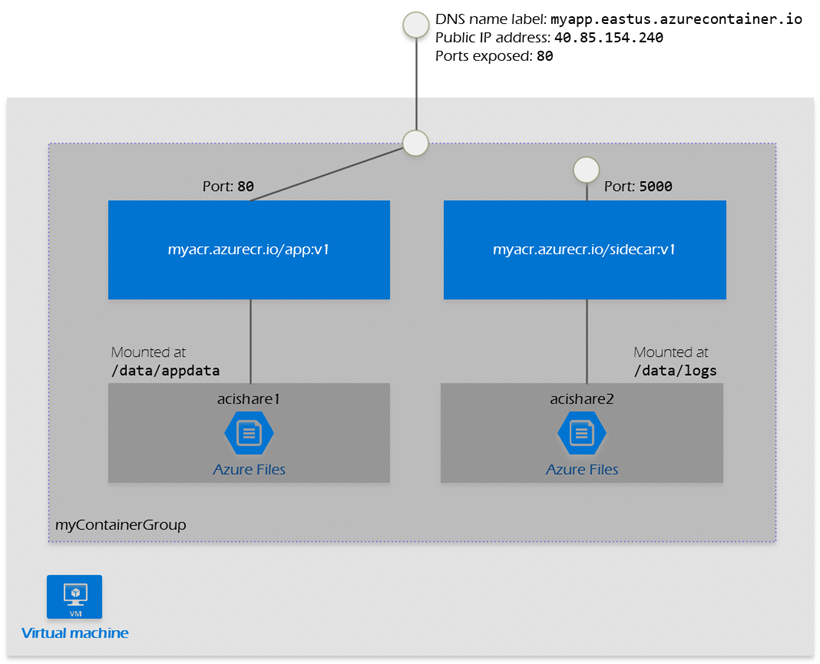

# Containers
**NOTE:** Virtual machines provide a complete isolation and strong security boundaries than containers.


## Azure Container Registry
Like Docker Hub, but private.

## Azure Container Instance

### Just Instance
1. Custom sizes. You specify CPU cores (from 0.1 to 4 vCPU) and memory (from 0.1 to 16 GB) for each container at deployment time. Resource allocation is fixed for the lifetime of the container group.
2. Persistent storage. Containers support direct mounting of Azure Files file shares.


### Container Group
1. A container group is a collection of containers that get scheduled on the same host machine. The containers in a container group share a lifecycle, resources, local network, and storage volumes. It's similar in concept to a pod in Kubernetes.
2. Configured using a YAML or ARM template.
3. Can be scheduled on a single host machine.
4. Can be assigned a DNS name label.
5. Can expose a single public IP address, with one exposed port.
6. Can consist of multiple containers. One container listens on port 80, while the other listens on port 5000.
7. Can include multiple Azure file shares as volume mounts, and each container mounts one of the shares locally.
8. Example:Create a multi-container group to hold your **front-end container** and **back-end container**. The front-end container can serve a web app. The back-end container can run a service to retrieve data.



```json
{
  "$schema": "https://schema.management.azure.com/schemas/2015-01-01/deploymentTemplate.json#",
  "contentVersion": "1.0.0.0",
  "parameters": {
    "containerGroupName": {
      "type": "string",
      "defaultValue": "myContainerGroup",
      "metadata": {
        "description": "Container Group name."
      }
    }
  },
  "variables": {
    "container1name": "aci-tutorial-app",
    "container1image": "mcr.microsoft.com/azuredocs/aci-helloworld:latest",
    "container2name": "aci-tutorial-sidecar",
    "container2image": "mcr.microsoft.com/mirror/docker/library/alpine:3.20"
  },
  "resources": [
    {
      "name": "[parameters('containerGroupName')]",
      "type": "Microsoft.ContainerInstance/containerGroups",
      "apiVersion": "2019-12-01",
      "location": "[resourceGroup().location]",
      "properties": {
        "containers": [
          {
            "name": "[variables('container1name')]",
            "properties": {
              "image": "[variables('container1image')]",
              "resources": {
                "requests": {
                  "cpu": 1,
                  "memoryInGb": 1.5
                }
              },
              "ports": [
                {
                  "port": 80
                },
                {
                  "port": 8080
                }
              ]
            }
          },
          {
            "name": "[variables('container2name')]",
            "properties": {
              "image": "[variables('container2image')]",
              "command": ["sh", "-c", "apk add --no-cache curl && while true; do curl -I http://localhost; sleep 3; done"],
              "resources": {
                "requests": {
                  "cpu": 1,
                  "memoryInGb": 1.5
                }
              }
            }
          }
        ],
        "osType": "Linux",
        "ipAddress": {
          "type": "Public",
          "ports": [
            {
              "protocol": "tcp",
              "port": 80
            },
            {
                "protocol": "tcp",
                "port": 8080
            }
          ]
        }
      }
    }
  ],
  "outputs": {
    "containerIPv4Address": {
      "type": "string",
      "value": "[reference(resourceId('Microsoft.ContainerInstance/containerGroups/', parameters('containerGroupName'))).ipAddress.ip]"
    }
  }
}
```

```yaml
apiVersion: '2021-10-01'
location: eastus
name: my-container-group 
properties:
  containers:
  - name: web-frontend
    properties:
      image: mcr.microsoft.com/azuredocs/aci-helloworld
      resources:
        requests:
          cpu: 1.0        # Container 1 CPU
          memoryInGB: 1.5 # Container 1 RAM
      ports:
      - port: 80
  - name: sidecar-logger
    properties:
      image: mcr.microsoft.com/azuredocs/aci-tutorial-sidecar
      resources:
        requests:
          cpu: 0.5        # Container 2 CPU
          memoryInGB: 0.5 # Container 2 RAM
  osType: Linux
  ipAddress:
    type: Public
    ports:
    - protocol: tcp
      port: 80
```

## Azure Container Apps
1. Azure Container Apps is a serverless platform that allows you to maintain less infrastructure and save costs while running containerized applications. Instead of worrying about server configuration, container orchestration, and deployment details, Container Apps provides all the up-to-date server resources required to keep your applications stable and secure.
2. Common uses of Azure Container Apps include:
    - Deploying API endpoints
    - Hosting background processing jobs
    - Handling event-driven processing
    - Running microservices
3. Applications built on Azure Container Apps can dynamically scale based on the following characteristics:
    - HTTP traffic
    - Event-driven processing
    - CPU or memory load
    - Any KEDA-supported scaler
4. Azure Container Apps doesn't provide direct access to the underlying Kubernetes APIs. Though powered by Kubernetes and open-source technologies like Dapr, KEDA, and envoy.


### Multi-container
1. Azure Container Instance and Azure Container Apps support multi-container groups. The YAML is the same.
2. In Azure Container Instance, you can have multiple containers in a container group. But they all share the same network namespace and can communicate with each other using localhost.
3. In Azure Container Apps, you can have multiple containers in a container group. But they all share the same network namespace and can communicate with each other using localhost. However, you can also use a shared volume to share data between containers. This is useful for scenarios where you have a web server and a database server in the same container group.
4. Difference is pricing.
5. "Which service is best for a multi-container task that runs once a day and then stops?" → ACI (Container Group).
6. "Which service is best for a multi-container web app that needs scaling and SSL?" → ACA (Container Apps).

| Feature | Azure Container Apps (ACA) | Azure Container Instance (ACI)
| --- | --- | --- |
| Scaling to Zero | Yes. When no one hits your site, you pay $0. | No. It stays on until you delete it. You pay for every second. |
| Free Grant | Yes. First 180,000 vCPU-seconds/month are free. | No. There is no free tier for ACI. |
| Efficiency | Best for web apps with "spiky" traffic. | Best for batch jobs (e.g., "Run this script for 5 minutes and die"). |

## Azure Kubernetes Service

| Feature | Azure Container Apps (ACA) | Azure Kubernetes Service (AKS)
| --- | --- | --- |
| Overview | ACA is a serverless container platform that simplifies the deployment and management of microservices-based applications by abstracting away the underlying infrastructure. | AKS simplifies deploying a managed Kubernetes cluster in Azure by offloading the operational overhead to Azure. It’s suitable for complex applications that require orchestration. |
| Deployment | ACA provides a PaaS experience with quick deployment and management capabilities. | AKS offers more control and customization options for Kubernetes environments, making it suitable for complex applications and microservices. |
| Management | ACA builds upon AKS and offers a simplified PaaS experience for running containers. | AKS provides a more granular control over the Kubernetes environment, suitable for teams with Kubernetes expertise. |
| Scalability | ACA supports both HTTP-based autoscaling and event-driven scaling, making it ideal for applications that need to respond quickly to changes in demand. | AKS offers horizontal pod autoscaling and cluster autoscaling, providing robust scalability options for containerized applications. |
| Use Cases | ACA is designed for microservices and serverless applications that benefit from rapid scaling and simplified management. | AKS is best for complex, long-running applications. These applications require full Kubernetes features and tight integration with other Azure services. |


## Container management
1. Azure Container Instances (ACI) is best for isolated, short-lived tasks. 
2. Azure Container Apps (ACA) serves serverless microservices. 
3. Azure Kubernetes Service (AKS) provides full Kubernetes control for complex orchestration needs.

## Difference between ACI and ACA

| Feature | ACI (The "Manual" Specialist) | ACA (The "Automated" Manager)
| --- | --- | --- |
| Primary Vibe | Task-oriented. "I need to run this script right now." | Service-oriented. "I need this app to be available." |
| Startup/Stop | Manual/Event-driven. You tell it when to start; it stops when the process ends. | Traffic-driven. It wakes up when a user visits and sleeps when they leave. |
| Orchestration | None. No load balancer, no SSL management, no scaling. | Full. Built-in Ingress, CORS (which you just used!), and Auto-scaling. |
| Best For | Batch jobs, CI/CD runners, or bursting from AKS. | Web APIs, microservices, and frontends. |
