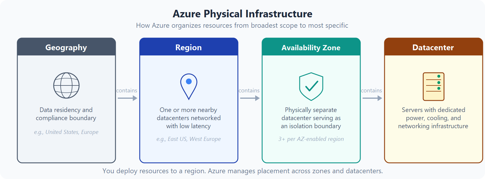
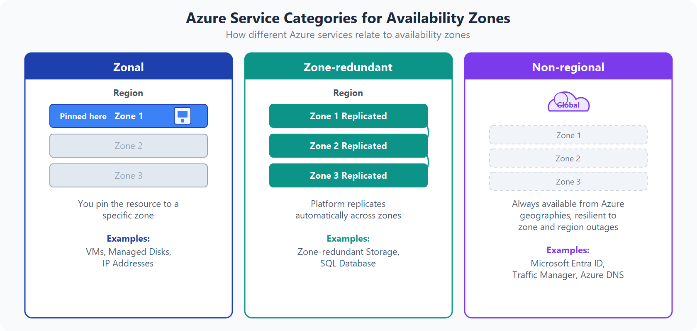
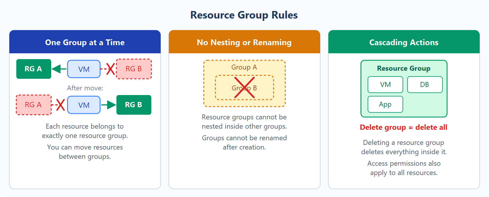
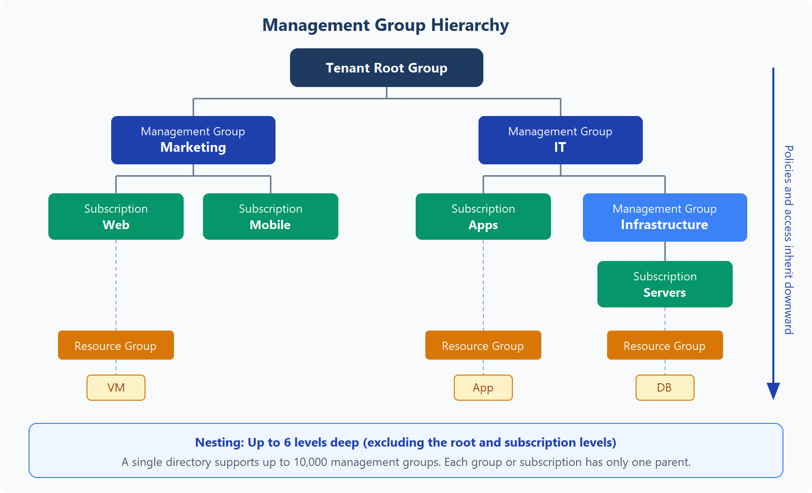

# Infrastructure

## Azure Geographies
[read](https://learn.microsoft.com/en-us/training/modules/describe-core-architectural-components-of-azure/5-describe-azure-physical-infrastructure)
1. Just take note, or "paired" region.
2. Sovereign regions:
    - US Government: physical and logical network-isolated instances of Azure for U.S. government agencies and partners. These datacenters are operated by screened U.S. personnel and include additional compliance certifications.
    - China: available through a unique partnership between Microsoft and 21Vianet, whereby Microsoft doesn't directly maintain the datacenters.

## Availabilty Zones

1. Note of Global, meaning no zones at all.

## Resource Group

1. Everything resources has to be under a resource group.
2. No nesting is allowed.
3. You can move resources to different resource group.
4. Resources does not define region (metadata), but region is a property of resources. Meaning VM can be in US, but the resource group can be in EU.
5. Lock can be applied on resource group or resources. It prevents accidental deletion or modification of resources.
6. Resources are just group doesn't restricts network traffic. Meaning resources in different resource group can communicate with other resource group's resources by default.
7. Action or setting at the Resource Group level are applied to all the resources in the resource group.

## Hierarchy

