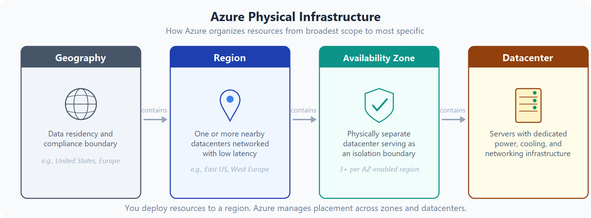
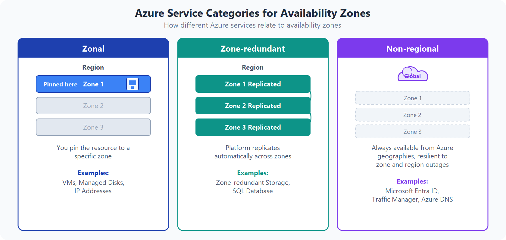
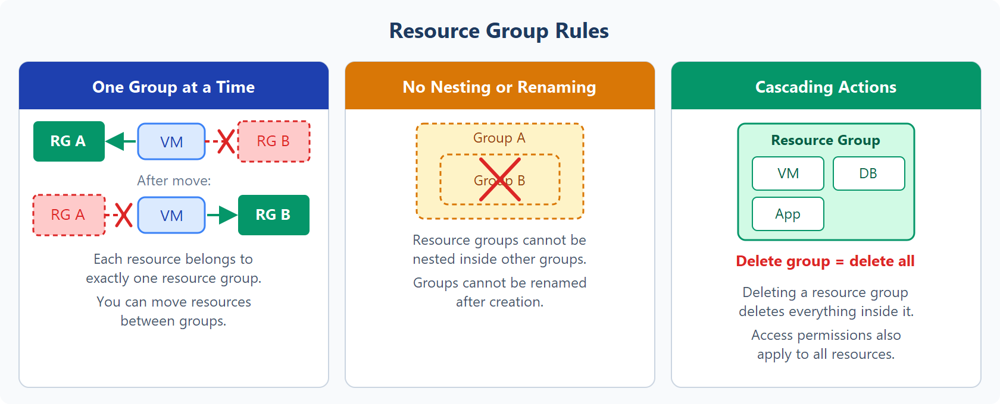
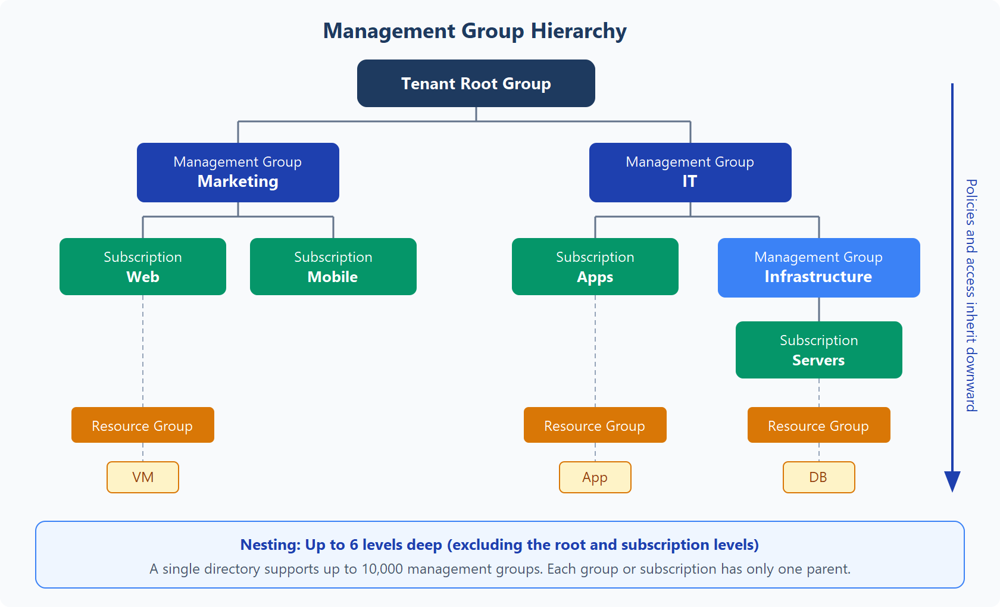

# Infrastructure

## Azure Geographies
[read](https://learn.microsoft.com/en-us/training/modules/describe-core-architectural-components-of-azure/5-describe-azure-physical-infrastructure)
1. Just take note, or "paired" region.
2. Sovereign regions:
    - US Government: physical and logical network-isolated instances of Azure for U.S. government agencies and partners. These datacenters are operated by screened U.S. personnel and include additional compliance certifications.
    - China: available through a unique partnership between Microsoft and 21Vianet, whereby Microsoft doesn't directly maintain the datacenters.

## Availabilty Zones

1. Note of Global, meaning no zones at all.

## Resource Group

1. Everything resources has to be under a resource group.
2. No nesting is allowed.
3. You can move resources to different resource group.
4. Resources does not define region (metadata), but region is a property of resources. Meaning VM can be in US, but the resource group can be in EU.
5. Lock can be applied on resource group or resources. It prevents accidental deletion or modification of resources.
6. Resources are just group doesn't restricts network traffic. Meaning resources in different resource group can communicate with other resource group's resources by default.
7. Action or setting at the Resource Group level are applied to all the resources in the resource group.
8. Resources in Resource group are seperated. E.g. if VNET in RG1 and NSG in RG2 with same region, they can connect.
9. Resource that cannot be moved
  - App Service Managed Certificates cannot be moved because they are tightly bound to a specific resource ID and environment lifecycle.
    - Free Managed Certificates: App Service Managed Certificates are tightly scoped to the specific app and resource group where they were generated, meaning they have no independent Key Vault ID or transferable external metadata. Azure blocks their movement, requiring you to delete and recreate them post-move.
    - Key Vault Dependencies: If your custom certificates are imported from Azure Key Vault, the certificate reference breaks when the parent app moves across certain subscription or permission boundaries, requiring re-binding of the TLS/SSL certificate mapping.
  - App Service Environments (ASE): You cannot move an internal or external App Service Environment to a new resource group or subscription; you must rebuild the environment. This is a Service with full CPU etc isolation.
  - Managed Identities: System-assigned or user-assigned managed identities often face strict limitations or fail cross-subscription boundaries depending on role assignments and scope.
  - Virtual Networks with Links: Subnets carrying resource navigation links or active virtual network peerings cannot be smoothly shifted without first breaking or dropping the specific link configurations.
  - Cross-Tenant Boundaries: Moving anything across different Microsoft Entra ID tenants is fundamentally unsupported as a direct metadata action.

## Hierarchy

