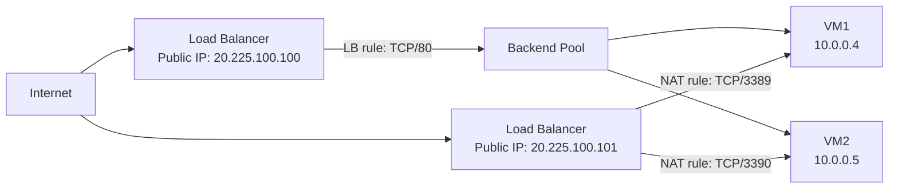

# Load Balancer
[Load Balancing](http://learn.microsoft.com/en-us/azure/load-balancer/quickstart-load-balancer-standard-public-portal)

## Public Load Balancers
1. Load balance internet traffic to your virtual machines (VMs). A public load balancer maps the public IP address and port number of incoming traffic to the private IP address and port number of the back-end pool VMs. 

## Private Load Balancers
1. Directs traffic to resources that are inside a virtual network or that use a VPN to access Azure infrastructure. 
2. Internal load balancer front-end IP addresses and virtual networks are never directly exposed to an internet endpoint.
3. An internal load balancer is used where private IPs are needed at the front end only.
4. Used within a VNet, cross-premises virtual network, or hybrid cloud.

## Supports
Both UDP and TCP.

## Inner works
### Front-end IP 
The front-end IP address is the address clients use to connect to your web application. A front-end IP address can be either a public or a private IP address. 

### Load balancer rules
A load balancer rule defines how traffic is distributed to the back-end pool. It uses the frontend IP, the back-end pool, the health probe, the protocol, the port, and the type of load balancing.

### Back-end pool
1. The back-end pool is a group of VMs or instances in a Virtual Machine Scale Set that responds to the incoming request.
2. The pool can also contain a mix of VMs and Virtual Machine Scale Set instances, but a VM cannot belong to both a standard load balancer back-end pool and a zone-redundant load balancer back-end pool.
3. Load balancer rules must have a unique name, but they cannot use the same IP address and port combinations.

### Health probes
1. Allows:
    - TCP custom probe
    - HTTP or HTTPS custom probe

### High availability port
A load balancer rule configured with protocol - all and port - 0 is known as a high availability (HA) port rule.
 

### Session Persistance
1. None (default): Specifies that any healthy VM can handle the request.
2. Client IP (2-tuple): Specifies that the same back-end instance can handle successive requests from the same client IP address.
3. Client IP and protocol (3-tuple): Specifies that the same back-end instance can handle successive requests from the same client IP address and protocol combination.

### Inbound NAT rules
1. You can use load balancing rules in combination with Network Address Translation (NAT) rules.
2. Useful for port forwarding to specific VMs within a backend pool (e.g., mapping separate frontend ports to RDP/SSH on different VMs).
3. It forwards traffic based on port, not based on load balancing algorithm.

#### Restrictions
- **No Health Probes**: Unlike load balancing rules, inbound NAT rules do not use health probes. Traffic is forwarded regardless of instance health.
- **Rule Limits**: Maximum of 1,500 total rules (including LB, NAT, and Outbound rules) per Standard Load Balancer.
- **Port Overlap**: Frontend ports cannot overlap with existing load balancing rules on the same IP.
- **1:1 Mapping**: Each frontend port maps to a specific backend instance. You cannot map one port to multiple VMs.

#### How to Create
1. Navigate to **Load Balancer** > **Settings** > **Inbound NAT rules**.
2. Click **+ Add**.
3. Configure the **Name**, **Frontend IP**, and **Backend Pool**.
4. Select the **Target Virtual Machine** and define the **Frontend Port** and **Backend Port** (e.g., Frontend 3389 -> VM1 3389, Frontend 3390 -> VM2 3389).

### Outbound rules
1. An outbound rule configures Source Network Address Translation (SNAT) for all VMs or instances identified by the back-end pool.
2. Used for:
    - **Internet Connectivity**: Provides outbound internet access for VMs in a backend pool that do not have their own public IP addresses.
    - **SNAT Port Management**: Allows you to manually scale and allocate SNAT ports to avoid "SNAT port exhaustion" when many outbound connections are made.
    - **Multiple Frontends**: Can use different public IPs for different backend pools to manage outbound traffic identity.

#### How to Create Outbound rules
1. Navigate to **Load Balancer** > **Settings** > **Outbound rules**.
2. Click **+ Add**.
3. Select the **Frontend IP address** (must be public) and the **Backend pool**.
4. Define the **Protocol** (TCP, UDP, or All).
5. (Optional) Set **Port allocation** to "Manually choose number of outbound ports" if you need specific scaling.

## Load Balancer SKU
1. Standard SKU
2. Gateway SKU - You "chain" it to the frontend of a Standard Load Balancer or a VM's NIC.

| Feature | Standard SKU | Gateway SKU
| --- | --- | --- |
| Backend Pool Size | Up to 1000 instances | Specific to NVMe 
| Availability Zones | Yes (Zone-redundant) | Yes 
| HA Ports | Yes (Internal only) | Yes (Required) 
| Global Tier | Yes | No 
| Secure by Default | Yes (Requires NSG) | Yes
| SLA | 99.99% | 99.99% |

### Good to know
- **Azure Front Door** (have cache) is an application-delivery network that provides a global load balancing and site acceleration service for web applications. It offers Layer 7 capabilities for your application like TLS/SSL offload, path-based routing, fast failover, a web application firewall, and caching to improve performance and high availability of your applications. Choose this option in scenarios such as load balancing a web app deployed across multiple Azure regions.
- **Azure Traffic Manager** is a DNS-based traffic load balancer that allows you to distribute traffic optimally to services across global Azure regions while providing high availability and responsiveness. Because Traffic Manager is a DNS-based load-balancing service, it load balances only at the domain level. For that reason, it can't fail over as quickly as Front Door, because of common challenges around DNS caching and systems not honoring DNS TTLs.
- **Azure Application Gateway**, when TLS is required, LB do not provide. Provides Application Delivery Controller (ADC) as a service, offering various Layer 7 load-balancing capabilities. Use it to optimize web farm productivity by offloading CPU-intensive TLS/SSL termination to the gateway. Application Gateway works within a region rather than globally.

## Application Gateway
 1. Uses a round-robin process to load balance requests to the servers in each back-end pool. Session stickiness ensures client requests in the same session are routed to the same back-end server. 
 2. Session stickiness is especially important with e-commerce applications where you don’t want a transaction to be disrupted because the load balancer bounces it around between back-end servers.
 3. Feature
    - Support for the HTTP, HTTPS, HTTP/2, and WebSocket protocols.
    - WAF - A web application firewall to protect against web application vulnerabilities.
    - End-to-end request encryption.
    - Autoscaling to dynamically adjust capacity as your web traffic load change.
    - **Connection draining** allowing graceful removal of back-end pool members during planned service updates.
    - Redirection. Redirection can be used to another site, or from HTTP to HTTPS.
    - Rewrite HTTP headers. HTTP headers allow the client and server to pass parameter information with the request or the response.
    - Custom error pages. Application Gateway allows you to create custom error pages instead of displaying default error pages. You can use your own branding and layout using a custom error page.
    - Health probes
4. Routing
    - Path-based routing, i.e /video/*  to 1 backendpool, /images/* to another backendpool
    - Multi-site hosting / Host-based routing, i.e www.contoso.com to 1 backendpool, www.fabrikam.com to another backendpool
    