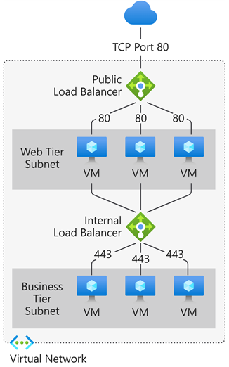
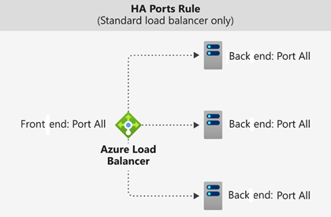

# Load Balancer

## Public Load Balancers
1. Load balance internet traffic to your virtual machines (VMs). A public load balancer maps the public IP address and port number of incoming traffic to the private IP address and port number of the back-end pool VMs. 

## Private Load Balancers
1. Directs traffic to resources that are inside a virtual network or that use a VPN to access Azure infrastructure. 
2. Internal load balancer front-end IP addresses and virtual networks are never directly exposed to an internet endpoint.
3. An internal load balancer is used where private IPs are needed at the front end only.
4. Used within a VNet, cross-premises virtual network, or hybrid cloud.

## Supports
Both UDP and TCP.

## Inner works
### Front-end IP 
The front-end IP address is the address clients use to connect to your web application. A front-end IP address can be either a public or a private IP address. 

### Load balancer rules
A load balancer rule defines how traffic is distributed to the back-end pool.

### Back-end pool
The back-end pool is a group of VMs or instances in a Virtual Machine Scale Set that responds to the incoming request.

### Health probes
1. Allows:
    - TCP custom probe
    - HTTP or HTTPS custom probe

### High availability port
A load balancer rule configured with protocol - all and port - 0 is known as a high availability (HA) port rule.
 

### Session Persistance
1. None (default): Specifies that any healthy VM can handle the request.
2. Client IP (2-tuple): Specifies that the same back-end instance can handle successive requests from the same client IP address.
3. Client IP and protocol (3-tuple): Specifies that the same back-end instance can handle successive requests from the same client IP address and protocol combination.

### Inbound NAT rules
You can use load balancing rules in combination with Network Address Translation (NAT) rules.

### Outbound rules
An outbound rule configures Source Network Address Translation (SNAT) for all VMs or instances identified by the back-end pool.

## Load Balancer SKU
1. Standard SKU
2. Gateway SKU - You "chain" it to the frontend of a Standard Load Balancer or a VM's NIC.

| Feature | Standard SKU | Gateway SKU
| --- | --- | --- |
| Backend Pool Size | Up to 1000 instances | Specific to NVMe 
| Availability Zones | Yes (Zone-redundant) | Yes 
| HA Ports | Yes (Internal only) | Yes (Required) 
| Global Tier | Yes | No 
| Secure by Default | Yes (Requires NSG) | Yes
| SLA | 99.99% | 99.99% |

### Good to know
- **Azure Front Door** (have cache) is an application-delivery network that provides a global load balancing and site acceleration service for web applications. It offers Layer 7 capabilities for your application like TLS/SSL offload, path-based routing, fast failover, a web application firewall, and caching to improve performance and high availability of your applications. Choose this option in scenarios such as load balancing a web app deployed across multiple Azure regions.
- **Azure Traffic Manager** is a DNS-based traffic load balancer that allows you to distribute traffic optimally to services across global Azure regions while providing high availability and responsiveness. Because Traffic Manager is a DNS-based load-balancing service, it load balances only at the domain level. For that reason, it can't fail over as quickly as Front Door, because of common challenges around DNS caching and systems not honoring DNS TTLs.
- **Azure Application Gateway** provides Application Delivery Controller (ADC) as a service, offering various Layer 7 load-balancing capabilities. Use it to optimize web farm productivity by offloading CPU-intensive TLS/SSL termination to the gateway. Application Gateway works within a region rather than globally.
