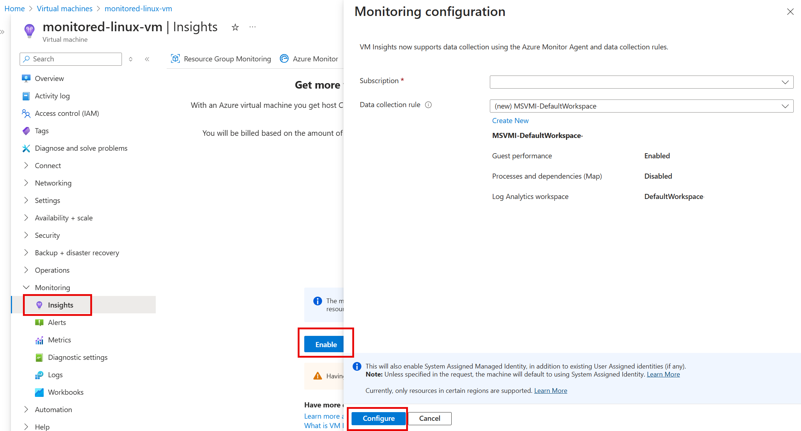

# Monitoring

## Basic Monitoring
Includes:

- VM availability
- CPU usage percentage (average)
- OS disk usage (total), not data disk
- Network operations (total)
- Disk operations per second (average)

## Data Collection Rules (DCR)
**Data Collection Rules (DCRs)** are a centralized way in Azure Monitor to define **what** data to collect, how to **transform** it, and **where** to send it. It replaces the older Windows and Linux diagnostic extensions and the legacy Azure Monitor Agent configuration.

While they are heavily used for Virtual Machines, **DCRs are NOT only for VMs**. They are the modern, standard method for data ingestion across multiple Azure services:
- **Azure Monitor Agent (AMA)**: Collects guest OS metrics, Windows Event Logs, and Syslog from VMs and Virtual Machine Scale Sets.
- **Logs Ingestion API**: Allows any custom application to send data directly to a Log Analytics Workspace via a DCR.
- **Container Insights**: Used to configure data collection for Azure Kubernetes Service (AKS).
- **Workspace Transformations**: Used to filter or modify data using KQL *before* it is stored in Log Analytics (saving costs by dropping unneeded logs).

**Key Components of a DCR:**
1. **Data Sources**: What to collect (e.g., Performance Counters, Event Logs, Custom Logs).
2. **Transformations (Optional)**: KQL queries to filter out sensitive/unnecessary data or change the structure before ingestion.
3. **Destinations**: Where to send the data (Log Analytics Workspace, Azure Monitor Metrics, or Event Hubs).

### Collecting Logs for Azure VMs with DCR
[Microsoft Learn: DCR](https://learn.microsoft.com/en-us/training/modules/monitor-azure-vm-using-diagnostic-data/6-collect-log-data?ns-enrollment-type=learningpath&ns-enrollment-id=learn.az-104-monitor-backup-resources)
1. **Step 1: Create a Data Collection Endpoint (DCE)** (Required for Custom Logs or private links).
2. **Step 2: Create a DCR**. You define the Data Sources and Destinations here.
3. **Step 3: Associate the DCR** with your target resources (e.g., VMs). Note that one DCR can be associated with multiple resources.
4. Each DCR is typically scoped to a specific OS type (Linux or Windows) when used with the Azure Monitor Agent, though some configurations allow both.
This can be enabled via VM Insights or installed manually. When you enable VM Insights, the Azure Monitor Agent is installed and a DCR is created automatically.

## Metrics
- **Azure Monitor Metrics** can store only metrics data
- **Azure Monitor Logs** can store both metrics and event logs.
- Azure Monitor doesn't collect logs by default. You need to install Azure Monitor Agent and set up a DCR to collect logs.
- Azure Monitor stores collected log data in a Log Analytics workspace. 
- Retains the data for 93 days with some exceptions.

## Insights
To gather Guest OS, enable it with [Insights](https://learn.microsoft.com/en-us/training/modules/monitor-azure-vm-using-diagnostic-data/5-enable-vm-insights)

## Creating Alerts
1. Create Alert Groups (to email, webhooks)
2. Create Alerts Rules (based on metrics or logs) and assign to an Alert Group.

## Activity Logs
1. Shows events that happened in the subscription. Track resource changes. 
2. Always enabled and available in Azure Monitor.

## Diagnostic Settings
1. Settings for diagnostics on Resource logs.
2. Destination: Azure Monitor, Event Hub, Storage Account

## Log Analytics Workspace
1. Workspace for log analysis.
2. Cost is based on volume of data processed.
3. Data retention is 31 days and 90 days for Sential. Can be increased to 2 years, but cost will increase.
4. Supports multiple workspace for one resource and across regions.
5. Table name might be AppDependencies

## Application Insights
1. It is a monitoring tool for web applications.
2. It can collect data from multiple sources, including:
    - Web applications
    - Desktop applications
    - Mobile applications
    - Cloud-hosted applications
3. Supports live metrics stream.
4. Supports multiple application for one resource and across regions.
5. This is a UI to Log Analytic Workspace. The table like AppDependencies are aliased as dependencies. 1 Workspace can have multiple App Insights but not the other way round.

## Custom Logs
1. **Definition**: Logs generated by applications or services that write to specific text or JSON files, rather than standard OS logging systems (like Windows Event logs or Syslog).
2. **Relationship with DCR**: Yes, they are directly related! With the modern Azure Monitor Agent (AMA), you use **Data Collection Rules (DCRs)** to define and collect Custom Logs. 
3. **How it works**: You configure a DCR to specify the file path pattern of your custom logs and map them to a custom table in your Log Analytics workspace. You also need a **Data Collection Endpoint (DCE)** to ingest these custom logs. Alternatively, you can use the Logs Ingestion API to send custom logs programmatically via a DCR.

## Kusto Query Language (KQL)
1. Query language for Log Analytics.

## Network Performance Monitoring 

### Azure Network Watcher
1. [Network Watcher](https://learn.microsoft.com/en-us/azure/network-watcher/network-watcher-overview) provides tools to monitor and diagnose network issues. It includes features like Network Diagnostic Tests (e.g., IP flow verify, NSG flow logs, connection troubleshooting) and Connection Monitor (for monitoring connectivity between endpoints).
2. Requires to install Network Watcher extention on the VM. Agent runs on port 443.
    
### Connection Monitor
1. Connection Monitor is a tool that helps you monitor the network connectivity between your Azure resources and the internet. It can be used to monitor the network connectivity between your Azure resources and the internet. 
2. Requires [Azure Monitor Agent (AMA)](https://learn.microsoft.com/en-us/azure/azure-monitor/agents/azure-monitor-agent-overview) and Data Collection Endpoint (DCE) installed on the VM.
3. Supports both Azure resources and On-premises endpoints.
4. Can be used with Azure Network Watcher, but not required. 
5. Supports Network Virtual Appliances (NVA).

### Topology
Topology service provides visualization of the network resources and their connections. It can be used to visualize the network connectivity between your Azure resources and the internet. 

### Connection Troubleshoot
[Connection Troubleshooting](https://learn.microsoft.com/en-us/azure/network-watcher/network-watcher-connectivity-troubleshoot-overview)

## Traffic Analytics
1. Traffic analytics analyzes network traffic flow logs from NSG (Network Security Groups) and **Firewall** (both Azure Firewall and Network Virtual Appliances (NVAs)) and presents them in a visual format.
2. It requires **NSG flow logs** to be enabled.
3. This is a subset to Azure Monitor Network Insights.
4. Monitors traffic between Azure resources and on-premises networks, and across Azure regions.
5. Can use **Service Chaining** to monitor traffic between Azure resources.

## Azure Monitor Network Insights
1. [Azure Monitor Network Insights](https://learn.microsoft.com/en-us/azure/azure-monitor/network-insights/network-insights-overview) provides a comprehensive view of network health and performance in Azure. It includes features like Network Diagnostic Tests (e.g., IP flow verify, NSG flow logs, connection troubleshooting) and Connection Monitor (for monitoring connectivity between endpoints).
2. It is a superset to Traffic Analytics.
3. Collects data from multiple sources, including:
    - **Traffic analytics**
    - **Connection Monitor**
    - **Network Watcher**
    - **Azure Firewall**
    - **Network Virtual Appliances (NVAs)**
    - **Network Security Groups (NSGs)**
    - **Route Tables**
    - **IP Addresses**
    - **Virtual Networks**
    - **Subnets**
    - **NICs**
    - **Load Balancers**
    - **Application Gateways**
    - **NAT Gateways**
    - **Virtual Network Gateways**
    - **ExpressRoute circuits**
    - **VPN Gateways**
    - **Private DNS Zones**
    - **Private DNS Zones**
    
