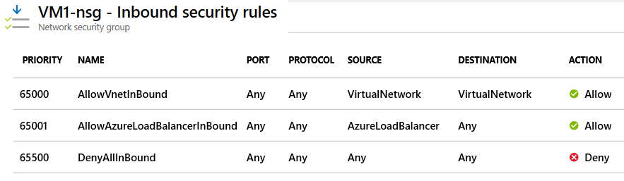
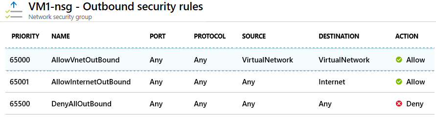
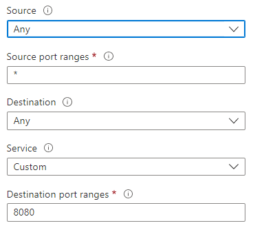

# Network Security Group (NSG)

1. Can assign to NIC or Subnet.
2. Optional to not even assigned, the default is now DENY.
    - Inbound: All traffic from the Internet is Denied.
    - Outbound: All traffic to the Internet is Denied by default.
    - Internal: Traffic within the same VNet is still Allowed.
3. Protected subnet are called DMZ (Demilitarized Zone).
4. Port assignment are stateful. Meaning you don't need to define output for the port.
5. You can't remove the default security rules. See below.
6. You can override a default security rule by creating another security rule that has a higher Priority setting for your network security group.

## Rules
1. For inbound traffic, Azure first processes network security group security rules for any associated subnets and then any associated network interfaces.
2. For outbound traffic, the process is reversed. Azure first evaluates network security group security rules for any associated network interfaces followed by any associated subnets.
3. If you have a **"subnet + NIC"** in your network security group, you must define an allow rule at each level. Otherwise, the traffic is denied for any level that doesn't provide an allow rule definition. 
4. Both NIC and Subnet rules are evaluated independently, and the most restrictive applies.

## Configuration

- **Source**: Identifies how the security rule controls inbound traffic. The value specifies a specific source IP address range to allow or deny. The source filter can be any **resource**, an **IP address range**, an **application security group**, or a **default service tag**.
- **Destination**: Identifies how the security rule controls outbound traffic. The value specifies a specific destination IP address range to allow or deny. The destination filter value is similar to the source filter. The value can be any **resource**, an **IP address range**, an **application security group**, or a **default service tag**.
- **Service**: Specifies the destination protocol and port range for the security rule. You can choose a predefined service like RDP or SSH or provide a **custom port range**. There are a large number of services to select from.
- **Action**: Specifies the action to take when the traffic matches the security rule. The action can be **Allow** or **Deny**.
- **Priority**: Specifies the priority of the security rule. The priority is a number between 1 and 4096. The lower the number, the higher the priority.
- **Name**: Specifies the name of the security rule.
- **Description**: Specifies the description of the security rule.

### Service Tags
Alternative to IP address range. It is a group of IP address ranges that are managed by Microsoft.
Example: AzureCloud, AzureLoadBalancer, etc.

## Application Security Group
1. Used To facilitate only Virtual Machine. Join your virtual machines's NIC to an application security group. Then you use the application security group as a source or destination in the network security group rules.\
2. Note: Only NIC can be assigned to application security group. Not the VM.
3. The source (Service Tag) is set to the Application Security Group.
4. **Limitation**: All NICs assigned to a specific ASG must reside within the same Virtual Network (VNet).
