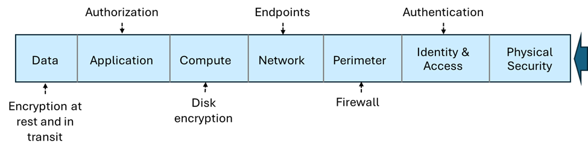

# Storage Account

## Service
1. Blob Storage
2. File Storage - Include SMB/NFS
3. *Queue Storage
4. *Table Storage - Similar to Cosmos
5. Data Disk - Mainly for VMs (hidden in new Storage Account and has own UI) or can be called as Managed Disk.

### Notes
1. All end with //mystorageaccount.(blob|table|queue|file).core.windows.net

## Types
1. Standard General Purpose v2
2. Premium Block Blob Storage - faster write/read, cannot modify
3. Premium File Storage - for SMB/NFS
4. Premium Page Blob Storage - use for to store with index

### Notes
1. Premium = using SSD, Standard = using HDD,
2. Premium are only LRS or ZRS in some available regions.
3. Premium once selected, cannot be changed and no Standard options are available. E.g. No Hot, Cold or Archive, can be selected.
4. Queue/Table are only Standard General Purpose v2/HDD.
5. Page Blob are data disk or managed disks for VM. It can be used also for AKS, Backup.
6. Even though a Managed Disk is fast, it has a major limitation: It is a regional resource. You cannot (easily) attach a Managed Disk in "Singapore" to a VM in "Hong Kong." .It is not accessible via a public URL or a simple connection string like a Storage Account is. You must have a compute resource (VM/AKS) to "mount" it.

Feature | Managed Disk | Azure Files| Azure Blob
--- | --- | --- | ---
Access Pattern | Block Storage (Local drive) | File Storage (Shared) | Object Storage (API/URL)
Protocol | SCSI / NVMe | SMB / NFS | REST / HTTPS
Simultaneous Access | Generally 1 VM (unless Shared) | Thousands of VMs/Users | Unlimited (Global)
Use Case | "Booting OS, SQL Server" | Shared department drives | "Images, Videos, Big Data"

## Replication
1. LRS - Locally Redundant Storage
2. GRS - Geo-Redundant Storage
3. RA-GRS - Read-Access Geo-Redundant Storage (means both region can be read)
4. ZRS - Zone-Redundant Storage
5. GZRS - Geo-Zone-Redundant Storage
6. RA-GZRS - Read-Access Geo-Zone-Redundant Storage

### Notes
1. Region replication has pairs, e.g. East US and West US.
2. Zone replication has 3 pairs, e.g. East US1, East US2, East US3.
3. GRS has 6 copies, 3 in LRS for 2 regions.
4. If GZRS, the replication is 6 copies with 3 in ZRS for 2 regions.
5. If LRS, there are still 3 copies but in the same data center.
6. Premium Storage Account does not support GRS or RA-GRS.

## Service Endpoints
1. Private Endpoints - $ and it's not via azure backbone
2. Service Endpoints - are endpoints that use azure backbone
3. Firewall
4. Use Virtual Network Settings to configure subnet access

## Blob
### Access Control
1. Private: (Default) Prohibit anonymous access to the container and blobs.
2. Blob: Allow anonymous public read access for the blobs only.
3. Container: Allow anonymous public read and list access to the entire container, including the blobs.

### Access Tier (In order)
1. Premium - If premium is selected. Cannot choose below.
2. Hot - for frequently accessed data
3. Cool - for infrequently accessed data
4. Cold - for infrequently accessed data
5. Archive - for rarely accessed data

#### Notes
1. You can only set to Hot or Cool during creation. After creation, you can move data between tiers.
2. If you have **Soft Delete** enabled (e.g., for 7 days) and you delete a blob, you continue to pay the storage cost for those 7 days while the blob sits in the "recycle bin."
3. Archive is "offline", it cannot be read and need to be rehydrated to either Hot, Cool or Cold tier.
4. Besides Hot tier, there are retention charges.

| Tier | Min. Retention Period | If deleted after 1 day... |
| --- | --- | --- |
| Hot  |  0 days | Pay for 1 day only. |
| Cool | 30 days | Pay for 1 day + 29 days penalty. |
| Cold | 90 days | Pay for 1 day + 89 days penalty. |
| Archive | 180 days | Pay for 1 day + 179 days penalty. |

## Soft delete
1. Minimum 7 days.
2. Default 14 days.
3. Max 1 year.
4. Purge protection(no deletion even with delete permission after enabled) can only be enabled if soft delete is enabled.

## Lifecycle Management
1. Can use days to set lifecycle to move DOWNward tier. Hot -> Cold but not Cold -> Hot. If wants to move the other way we call it rehydration and can take time depending on tiers.
2. Careful that it still charges for minimum retention.
3. Can be set to delete. Careful on exam question, if not asked to delete assume it to be archived.
4. Every access to the file resets the time again.

## Object replication
1. Object replication is supported when the source and destination accounts are in the Hot, Cool, or Cold tier. The source and destination accounts can be in different tiers.
2. Require:
    - Blob Versioning for both source and destination.
    - Blob Change Feed for source only. Either access/modified date.
3. Snapshot not supported.
4. There is "Last Access Date" or "Last Modified Date" to track the access time. If the blob is accessed, the last access date will be updated. **Last Access Date** needs to be turn on with **Access Time Tracking** optional. Else do not know which is deleted, update.
5. Only Blob storage.
6. Max 2 policy and 2 destination account.

## Type
Cannot be modified once selected:

1. Block Blobs
2. Append Blobs - useful for logging
3. Page Blobs - like data disk

## Tools
1. AzCopy - only for Blob or File.
2. Azure Storage Explorer
3. Azure Data Box Disk - See later scope it's a physical disk that send to Azure Center. Snowball/Snowcone
4. Import/Export Service - a ticket support and monitor in Azure to see you on-premise move to Azure data center.

## Azure File
1. Azure Files provides the SMB and NFS protocols, client libraries, and a REST interface that allows access from anywhere to stored files.
2. Can be use as replacement for NAS, has file sync capabilities.
3. True file/directory structure.

### Access Tier (In order)
1. *Premium - If premium is selected. cannot choose below options.
2. Transaction Optimized - Fastest but still HDD
3. Hot - balanced, still HDD
4. Cool - for infrequently accessed data, still HDD

### Azure File Sync
1. Need to install agent in OS
2. Cloud tiering is to cache file sync.

#### Cloud tiering
1. Allows frequently accessed files to be cached locally while other files are stored in Azure Files.
2. When a file is tiered, Azure File Sync replaces the file locally with a pointer. A pointer is commonly referred to as a reparse point. The parse point represents a URL to the file in Azure Files.

## Snapshot
1. Snapshots are incremental, read-only point-in-time copies at the share level per file.
2. To reduce time and cost only captures from the last snapshot.
3. Same experience for SMB and NFS shares in all Azure public regions.
4. Snapshot adds a unique timestamp to the share URI.
5. Uses the shares redundancy settings.
6. Up to 200 snapshots per file share for low-RPO recovery points.
7. Snapshots persist until deleted. Deleting the share deletes all snapshots.
8. Azure Backup can lease snapshots to help prevent accidental deletion.
9. Restore a file, folder, or full share; full restore requires only the latest snapshot.

## Soft delete
1. Soft delete enabled at the storage account level.
2. Soft delete transitions content to a soft deleted state instead of being permanently erased.
3. Soft delete lets you configure the retention period. The retention period is the amount of time that soft deleted file shares are stored and available for recovery.
4. Soft delete provides a retention period between 1 and 365 days.
5. Soft delete can be enabled on either new or existing file shares.
6. Use soft delete to recover data without paying ransom to cybercriminals.
7. The "Recycle Bin": If you had files that were already soft-deleted before you turned the feature off, they are not immediately purged. Azure will continue to honor their original retention period (e.g., the remaining days out of the 30 you configured). Once that old time limit expires, they will be permanently removed.

# Migration

Requires 72 hours and you can't just switch from LRS to GZRS directly.

Switch | to LRS | to GRS/RA-GRS | ZRS | GZRS/RA-GZRS
--- | --- | --- | --- | ---
LRS | - | Direct | Live/Manual | Live/Manual
to GRS/RA-GRS | Direct | - | Manual/Live (have to switch to LRS first) | M/Live
ZRS | Manual | Manual | - | Direct
GZRS / RA-GZRS | Manual | Manual | Direct | -

type | Direct | Live | Manual
--- | --- | --- | ---
general purpose v2 | ok | ok | ok
premium file share |    | ok | ok
premium block blob |    |    | ok
premium page blob  |    |    | 
managed disk       | ok |    | ok

* Note - if RA-GRS Must change to GRS first. 2 step to remove secondary.

# Migration

Requires 72 hours and you can't just switch from LRS to GZRS directly.

Switch | to LRS | to GRS/RA-GRS | ZRS | GZRS/RA-GZRS
--- | --- | --- | --- | ---
LRS | - | Direct | Live/Manual | Live/Manual
to GRS/RA-GRS | Direct | - | Manual/Live (have to switch to LRS first) | M/Live
ZRS | Manual | Manual | - | Direct
GZRS / RA-GZRS | Manual | Manual | Direct | -

type | Direct | Live | Manual
--- | --- | --- | ---
general purpose v2 | ok | ok | ok
premium file share |    | ok | ok
premium block blob |    |    | ok
premium page blob  |    |    | 
managed disk       | ok |    | ok

* Note - if RA-GRS Must change to GRS first. 2 step to remove secondary.

## Immutable Policy
1. Data cannot change for audit purposes.
2. Types:
    - Time-Based Retention - Cannot delete until time expires.
    - Legal Hold - Cannot delete until legal hold is removed.
3. Only for Blob storage (no file, table, queue). All those need to use Azure Backup Immutable Vault.
4. A service can have maximum of 1 legal hold and 1 time-based retention.

## Security

### Types
- Microsoft Entra ID
- Shared Key = Master Key and Secondary Key
- Shared Access Key = Limited permission, time bound, a http/https link (including file).
- Stored Access Policy = Similar to Shared Access Key but with ability to revoke access without changing the key. Max of **5** only.
- Anonymous = Public access

### Shared Access Key Controls
1. User Delegation
2. Account Level - 
3. Service Level - Allow service like delete/update on which type of blob

### Encryption
1. Only during CREATION.
3. All storage are 256-bit advanced encryption standard (AES) encryption.
4. Azure Storage encryption is enabled for all new and existing storage accounts and can't be disabled.
5. Type encryption:
   - Infrastructure encryption = enabled in account then 2 times encryption
   - Platform-managed key = cannot disable, cannot rotate
   - Customer-managed key = See later, it applies to all. If you use Customer-Managed Keys (CMK), the Azure Key Vault storing those keys must have both Soft Delete and Purge Protection enabled in the Key Vault.

#### Customer Managed Keys
1. Hardware Security Module (HSM) 
2. Bring Your Own Key (BYOK)
3. Requires CMK in Key Vault to have:
    - soft delete
    - purge protection

## Storage Insights
1. Real-Time Monitoring. Azure Storage Insights enables real-time monitoring of storage accounts, allowing you to track usage trends, monitor performance, and set up alerts for any anomalies.
2. Security Auditing. It aids in security auditing by providing comprehensive monitoring and detailed logs, which are essential for ensuring compliance and identifying any security issues.
3. Health Analysis and Optimization. The tool helps in health analysis and optimization of storage accounts, ensuring security and optimal performance.
Contains:
    - Metrics and Logs
    - Enhanced Security and Compliance.
    - Role-Based Access Control (RBAC).
    - Unified View