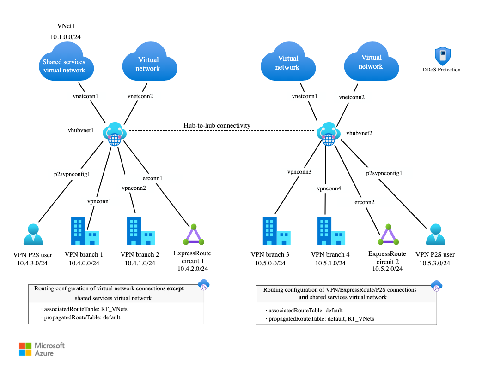

# VPN
1. This is more to Azure Virtual WAN. Coverage of AZ-305 not AZ-104. Objective is for On-Premises to Azure connectivity.
2. General Overview:
    - Azure VPN Gateway - Type of virtual network gateway that sends encrypted traffic between an Azure virtual network and an on-premises location.
    - Azure Express Route - Azure ExpressRoute uses a private, dedicated connection through a non-Microsoft connectivity provider. The connection is established using a partner that has a direct peering with Microsoft. (Note: express route with VPN failover is more for high availability)
    - Azure Virtual WAN - centrally manage site-to-site VPN connections 
    - Hub & Spoke (modern Virtual WAN) -  Hub & Spoke is a network topology that uses a central hub to connect multiple spokes, which are virtual networks that are connected to the hub

## Diagram

## SKU for VPN Gateway
1. Usage
| Service | Point-to-Site | Site-to-Site
| --- | --- | ---
| Azure Supported Services | Cloud Services and Virtual Machines | Cloud Services and Virtual Machines
| Typical Bandwidths | Based on the gateway SKU | Typically < 10 Gbps aggregate
| Protocols Supported | Secure Sockets Tunneling Protocol (SSTP), OpenVPN, and IPsec | IPsec
| Routing | RouteBased (dynamic) | We support PolicyBased (static routing) and RouteBased (dynamic routing VPN)
| Connection resiliency | active-passive or active-active | active-passive or active-active
| Typical use case | Secure access to Azure virtual networks for remote users | Dev, test, and lab scenarios and small to medium scale production workloads for cloud services and virtual machines
2. SKU List (https://learn.microsoft.com/en-us/azure/vpn-gateway/vpn-gateway-about-vpngateways), Basic has no BGP the rest of SKU are based on speed.