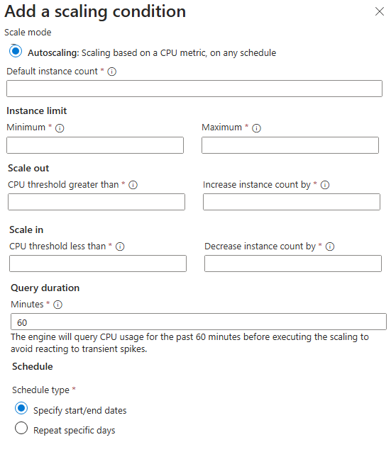
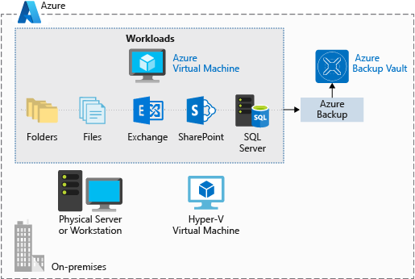

# Virtual Machines

| Feature | Description |
| --- | --- |
| **VM Size** | Determines CPU, RAM, and storage performance. |
| **OS Disk** | The boot disk for the VM. Can be Premium SSD, Standard SSD, or Standard HDD. |
| **Data Disks** | Additional disks attached to the VM for data storage. |
| **Network Interface (NIC)** | Connects the VM to the virtual network. |
| **Public IP Address** | Optional address for internet access. |
| **Availability Set** | Spreads VMs across physical hardware to prevent downtime. |
| **Availability Zone** | Spreads VMs across different data centers for zone-level redundancy. |
| **VM Scale Set** | Automatically manages and scales a group of identical VMs. |
| **Azure Backup** | Service for backing up and restoring VMs. |
| **Azure Site Recovery** | Service for disaster recovery and business continuity. |
| **Azure Monitor** | Service for monitoring VM performance and health. |
| **Azure Advisor** | Provides recommendations for optimizing VM performance and cost. |
| **Azure Policy** | Enforces organizational standards and assesses compliance. |
| **Azure Role-Based Access Control (RBAC)** | Controls access to VM resources. |
| **Azure Disk Encryption** | Encrypts VM disks for security. |
| **Azure Security Center** | Provides security management and threat protection. |
| **Azure Advisor** | Provides recommendations for optimizing VM performance and cost. |
| **Azure Policy** | Enforces organizational standards and assesses compliance. |
| **Azure Role-Based Access Control (RBAC)** | Controls access to VM resources. |
| **Azure Disk Encryption** | Encrypts VM disks for security. |
| **Azure Security Center** | Provides security management and threat protection. |

## Sizes
Checkout from Size->Overview in Azure Learn site. Principal is CPU vs Memory. This is vertical scaling.

## Availability Set
1. Split to
    - Fault domain = Physical. This is on diff rack.
    - Update domain = Software. Use for software update/shutdown.
2. Control on domain/fault

| Setting | Min (Allowed) | Max (Allowed) | Common Default |
| --- | --- | --- | --- |
| Fault Domains | 1 | 3 (depends on region) | 2 |
| Update Domains | 1 | 20 | 5 |

## Availability Zone
1. Region always have 3 AZs
2. Az cannot be switch to Availability Set, so are AS to AZ.
3. Data transfer between AZ cost $, within AZ is free.

## VM Scale Set
1. Controlled by Load Balancer to add remove servers.
2. 2 Types of orchestration that cannot be mixed:
    - Uniform (serverless)
    - Flexible (has VM/NIC/Disk)
3. Max of 100 groups.
4. Load balancer:
    [ ] Standard LB can handle: Standalone VMs, Availability Sets, and Availability Zones.
    [ ] Basic LB can handle: Only VMs in a single Availability Set or a single Scale Set.
5. This is layer 4 load balancer, handling TCP/UDP. For Layer 7, requires to use Application Gateway.
6. Scaling condition:

## VM extensions
1. Used to configure and install more software on your virtual machine after the initial deployment. 
2. OS based:
    - Linux uses waagent (Linux Agent)
    - Windows uses Windows Azure VM Agent, installed by default. Has option to install diagnostic agent.
3. Can be listed with command (az vm extension list --resource-group <resource-group-name> --vm-name <vm-name>)
4. Custom script, allows shell script `https://learn.microsoft.com/en-us/azure/virtual-machines/extensions/custom-script-windows`. Don't use the Custom Script Extension to run Update-AzVM with the same VM as its parameter. The extension will wait for itself.

## Azure automation / runbook
Just a script to autoshutdown, or run some automation.

## Auto - shutdown
Optional to use runbook/automation to run this as well.

## Azure Site Recovery
Azure Site Recovery replicates workloads from a primary site to a secondary location. If an outage happens at your primary site, you can fail over to a secondary location. This failover enables users to continue to access your applications without interruption. You can then fail back to the primary location after it's up and running again. Azure Site Recovery is about replication of virtual or physical machines; it keeps your workloads available in an outage.

## Backup
1. Backup is done by Azure Backup service, a subset of Recovery Services.
2. Azure Backup doesn't limit the amount of inbound or outbound data you transfer. Azure Backup also doesn't charge for the data that is transferred.

