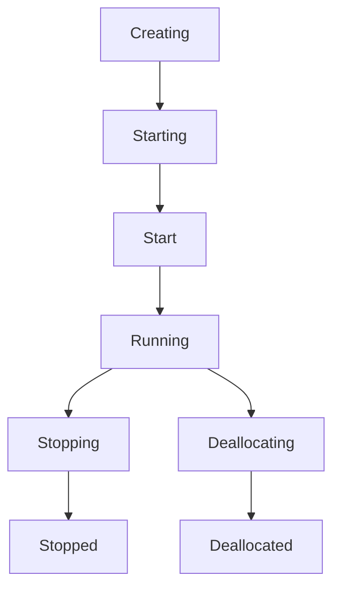

# Virtual Machines
[Link to VM Size](https://learn.microsoft.com/en-us/azure/virtual-machines/)

| Feature | Description |
| --- | --- |
| **VM Size** | Determines CPU, RAM, and storage performance. |
| **OS Disk** | The boot disk for the VM. Can be Premium SSD, Standard SSD, Standard SSD LRS (not available for OS disk), Ultra Disk, Ultra Disk LRS (not available for OS disk), Standard HDD. |
| **Data Disks** | Additional disks attached to the VM for data storage. |
| **Network Interface (NIC)** | Connects the VM to the virtual network. |
| **Public IP Address** | Optional address for internet access. |
| **Availability Set** | Spreads VMs across physical hardware to prevent downtime. |
| **Availability Zone** | Spreads VMs across different data centers for zone-level redundancy. |
| **VM Scale Set** | Automatically manages and scales a group of identical VMs. |
| **Azure Backup** | Service for backing up and restoring VMs. |
| **Azure Site Recovery** | Service for disaster recovery and business continuity. |
| **Azure Monitor** | Service for monitoring VM performance and health. |
| **Azure Advisor** | Provides recommendations for optimizing VM performance and cost. |
| **Azure Policy** | Enforces organizational standards and assesses compliance. |
| **Azure Role-Based Access Control (RBAC)** | Controls access to VM resources. |
| **Azure Disk Encryption** | Encrypts VM disks for security. |
| **Azure Security Center** | Provides security management and threat protection. |
| **Azure Advisor** | Provides recommendations for optimizing VM performance and cost. |
| **Azure Policy** | Enforces organizational standards and assesses compliance. |
| **Azure Role-Based Access Control (RBAC)** | Controls access to VM resources. |
| **Azure Disk Encryption** | Encrypts VM disks for security. |
| **Azure Security Center** | Provides security management and threat protection. |

## Sizes
Checkout from Size->Overview in Azure Learn site. Principal is CPU vs Memory. This is vertical scaling.

## Availability Set
1. Split to
    - Fault domain = Physical, same network and hardware. This is on diff rack.
    - Update domain = Software. Use for software update/shutdown.
2. Control on domain/fault

| Setting | Min (Allowed) | Max (Allowed) | Common Default |
| --- | --- | --- | --- |
| Fault Domains | 1 | 3 (depends on region) | 2 |
| Update Domains | 1 | 20 | 5 |

3. Splitting is based on Round Robin, If you have an Availability Set configured with 3 Fault Domains (FD) and 5 Update Domains (UD), the placement looks like this as you add VMs:
4. Update Domain group, restarts together.
5. Restarting VM individually, does not follow the UD group and may reorder the Update Domain. Also Placement is Immutable.
6. If there is > X update domain, then there must be >= X fault domain. It does not have to be exact. But if UD is 1, FD must be 1, if UD is 2, FD must be 1 or 2 ...

| VM Number | Fault Domain (Rack) | Update Domain (Reboot Group) |
| --- | --- | --- |
| VM 1 | FD 0 | UD 0 |
| VM 2 | FD 1 | UD 1 |
| VM 3 | FD 2 | UD 2 |
| VM 4 | FD 0 (Recycles) | UD 3 |
| VM 5 | FD 1 | UD 4 |
| VM 6 | FD 2 | UD 0 (Recycles) |

## Availability Zone
1. Region always have 3 AZs
2. Az cannot be switch to Availability Set, so are AS to AZ.
3. Data transfer between AZ cost $, within AZ is free.

## VM Scale Set
1. Controlled by Load Balancer to add remove servers.
2. 2 Types of orchestration that cannot be mixed:
    - Uniform (serverless) - max 100 VMs in a single Zone.
    - Flexible (has VM/NIC/Disk) - max 1000 VMs spread across AZs. Not all zone are supported and Spot VMs are not supported.
3. Max of 100 groups.
4. Note: No longer has different SKU of basic/standard LB.
5. This is layer 4 load balancer, handling TCP/UDP. For Layer 7, requires to use Application Gateway.
6. Can only be in a Availability Zone or Availability Set, not both.
7. Only in 1 region. No cross region. Use Traffic Manager for cross-region.

### Spot VM
Use Spot VMs for:
1. compute-intensive, fault-tolerant workloads like batch processing, rendering, or big data analytics
2. short-term workloads that can tolerate interruptions, such as batch processing, rendering, or big data analytics.
**Note**: Spot VMs are not supported for Flexible VM Scale Sets, and Spot VMs can only be deployed in Zone-Redundant VM Scale Sets.

### Scale in policy
[Scale-in policy](https://learn.microsoft.com/en-us/azure/virtual-machine-scale-sets/virtual-machine-scale-sets-scale-in-policy)
Configures to remove based on:
1. Default
    - Balance virtual machines across availability zones (if the scale set is deployed in zone-spanning configuration)
    - Balance virtual machines across fault domains (best effort)
    - Delete virtual machine with the highest instance ID
2. NewestVM - delete the newest, or most recently created virtual machine in the scale set, after balancing VMs across availability zones
3. OldestVM - delete the oldest, or least recently created virtual machine in the scale set, after balancing VMs across availability zones.

## VM extensions
1. Used to configure and install more software on your virtual machine after the initial deployment. 
2. OS based:
    - Linux uses waagent (Linux Agent)
    - Windows uses Windows Azure VM Agent, installed by default. Has option to install diagnostic agent.
3. Can be listed with command (az vm extension list --resource-group <resource-group-name> --vm-name <vm-name>)
4. Custom script, allows shell script `https://learn.microsoft.com/en-us/azure/virtual-machines/extensions/custom-script-windows`. Don't use the Custom Script Extension to run Update-AzVM with the same VM as its parameter. The extension will wait for itself.

## Azure automation / runbook
Just a script to autoshutdown, or run some automation.

## Auto - shutdown
Optional to use runbook/automation to run this as well.

## Azure Site Recovery
Azure Site Recovery replicates workloads from a primary site to a secondary location. If an outage happens at your primary site, you can fail over to a secondary location. This failover enables users to continue to access your applications without interruption. You can then fail back to the primary location after it's up and running again. Azure Site Recovery is about replication of virtual or physical machines; it keeps your workloads available in an outage.

## Backup
1. Backup is done by Azure Backup service, a subset of Recovery Services.
2. Azure Backup doesn't limit the amount of inbound or outbound data you transfer. Azure Backup also doesn't charge for the data that is transferred.
3. VM has extension for 2 type of backup:
    - Storage: Snapshots when using an Azure VM or Azure Files.
    - Stream backup: For databases like SQL or High-performance Analytic Appliance (HANA) running in VMs.

## Differences

Scope| Tool |What happens if...
--- | --- | ---
Rack Level | Fault Domains (inside Availability Set) | A single power supply or network switch on a rack fails.
Server Level | Update Domains (inside Availability Set) | Microsoft patches the physical host server where your VM lives.
Datacenter Level | Availability Zones | An entire building loses power or has a cooling failure.
Traffic Level | Load Balancer Health Probes | "A VM is ""up"" but your application (IIS/Apache/Service) has crashed."

## LifeCycle
1. Deallocated means the VM gets removed from the host, so you will not be charged for compute, but you will still be charged for storage.
2. Public IP are released for stop and deallocate.

## Extra notes
1. VM must be shutdown:
    - if NIC is to be added/removed.
    - if a VM is moved from one Availability Set to another.
    - if a VM is resized to a different VM size.
2. VM doesn't need to shutdown:
    - if Public IP is to be added/removed/changed. It only takes effect when the VM is restarted.
    - if Disk is to be added/removed/resized.
    - if VM extension is to be added/removed/updated.
    - if VM is to be moved from one Availability Zone to another.
3. Disk Types:
    - OS type
    - Data type
    - Temp type
4. Only Standard HDD, Standard SSD, Premium SSD can be attached as OS disk. For data disk, all disk types are supported.
5. Disk Resizing doesn't need to be detached. But requires re-partitioning within the OS to use the new space.
6. Disk Resize can only increase size, not decrease.

## Extra - Extra AZ-305
1. Flapping (for scale set VM), happens when:
    - CPU threshold is met, scale out, CPU usage drops, scale in and kept repeating.
    - If clash in configuration, e.g. CPU scale out at 45% and memory scale in at 80%, it will keep jumping between scale out and scale in. An error will be prompted for conflicting rules.
    - This can be prevented by setting a "Cooldown" period (Scale-in cooldown and Scale-out cooldown).
    - The cool-down period is the time that the scale set waits before evaluating whether to scale out or in again, and it should be longer than the time it takes for the application to stabilize after a scale-out or scale-in event.
2. Cool-down period, is the time that the scale set waits before evaluating whether to scale out or in again, and it should be longer than the time it takes for the application to stabilize after a scale-out or scale-in event.
3. Windows OS 10/11 allows multi-session, so it is possible to have multiple users logging in at the same time.
4. Connection drain timeout, is the time that the scale set waits before removing a VM. Default is 5 minutes.

### Connection Cool-down (scale-in) period
1. Autoscale Cool-down Period (The "Wait to Scale" Period)
This is a setting in Virtual Machine Scale Sets (VMSS). It prevents "flapping," where a VM scales out and then immediately scales in because the metrics are jumping around.
2. The Example:
    1. Imagine you have a scale-out rule: "If CPU > 75% for 5 minutes, add 1 VM."
    2. 9:00 AM: CPU hits 80%.
    3. 9:05 AM: The 5-minute duration is met. Azure adds VM-2.
    4. 9:06 AM: VM-2 is starting up, but it isn't "helping" yet because the app hasn't fully loaded. CPU is still 80%.
    5. The Problem: Without a cool-down, Azure would see CPU is still 80% and immediately trigger VM-3, VM-4, etc., over-provisioning your resources.
    6. The Solution: You set a Cool-down of 10 minutes. Azure will now ignore all scaling triggers until 9:16 AM, giving VM-2 enough time to start up and actually lower the average CPU.
3. Connection Draining (The "Graceful Exit" Period)
While sometimes called a "cool-down," this is officially Connection Draining (for Application Gateway) or Inbound NAT/Load Balancer rules. It ensures that when a VM is being removed (Scale-in), users currently logged in don't get a "404" or "Connection Reset."
4. The Example:
    1. You have a Scale-in rule: "If CPU < 25%, remove 1 VM."
    2. User A is currently downloading a large 500MB file from VM-2.
    3. The Trigger: Average CPU drops to 20%. Azure decides to delete VM-2.
    4. The Problem: If Azure deletes the VM immediately, User A's download fails at 90%.
    5. The Solution: You set a Connection Draining timeout of 300 seconds (5 minutes).
    6. New users are immediately sent to VM-1.
    7. VM-2 is marked as "Draining." It stays alive just long enough for User A to finish their download.
    8. After 5 minutes (or once the connection closes), Azure finally deletes the VM.

#### Cool-down for Scale out
1. Scale-out Cool-down (The "Warm-up" Buffer)
When a scale-out event occurs, the cool-down period is primarily there to allow the new instances to become fully operational.
2. The Scenario: You add a VM because CPU is high.
3. The Wait: The cool-down starts the moment the scale-out is triggered.
4. The Reason: New VMs take time to "warm up" (boot OS, start IIS/Nginx, load cache). During this boot time, the average CPU of the set might still look high. Without a cool-down, Azure would think the first new VM didn't help and would keep spamming more VMs into existence.

#### Flapping and Thrashing
1. The scale-in cool-down is usually more conservative (often set longer) to prevent "thrashing."

| Feature | Flapping | Thrashing |
| --- | --- | --- |
| Layer |Management Plane (Autoscale).|Operating System / Hardware Plane.|
| Movement | Adding/Removing entire VMs.|Swapping data between RAM and Disk.|
| Solution|Increase Cool-down periods or widen the threshold gap.|Upgrade the VM Size (Vertical Scaling/Scale-up) to get more RAM.|
| Metric to Watch|Instance Count.|Disk IOPS and Memory Available. |