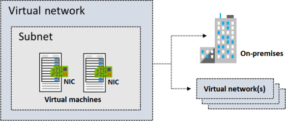

# Virtual Network

## Subnet
1. Must be specified with CIDR notation. E.g. 10.0.0.2/24

## Reserved IPs
Reserved address | Reason
--- | ---
192.168.1.0 | This value identifies the virtual network address.
192.168.1.1 | Azure configures this address as the default gateway.
192.168.1.2 and 192.168.1.3 | Azure maps these Azure DNS IP addresses to the virtual network space.
192.168.1.255 | This value supplies the virtual network broadcast address.

## Static IP

Static IP addresses don't change and are best for certain situations, such as:

DNS name resolution, where a change in the IP address requires updating host records.
IP address-based security models that require apps or services to have a static IP address.
TLS/SSL certificates linked to an IP address.
Firewall rules that allow or deny traffic by using IP address ranges.
Role-based virtual machines such as Domain Controllers and DNS servers.

## Type of IPs
1. Private IP addresses enable communication within an Azure virtual network and your on-premises network. You create a private IP address for your resource when you use a VPN gateway or Azure ExpressRoute circuit to extend your network to Azure.
2. Public IP addresses allow your resource to communicate with the internet. You can create a public IP address to connect with Azure public-facing services.

## IP address SKU

| SKU | Description |
| --- | --- |
| Basic | Basic SKU public IP addresses are available in a single region only. They're not zone-redundant. You can assign Basic SKU public IP addresses to resources that use Basic SKU load balancers. You can also assign them to resources that use Basic SKU public IP addresses. |
| Standard | Standard SKU public IP addresses are available in a single region only. They're zone-redundant. You can assign Standard SKU public IP addresses to resources that use Standard SKU load balancers. You can also assign them to resources that use Standard SKU public IP addresses. |

## IP address assignment

| Assignment | Description |
| --- | --- |
| Dynamic | Dynamic IP addresses are assigned to resources when they're created. They're not zone-redundant. You can assign dynamic IP addresses to resources that use Basic SKU load balancers. You can also assign them to resources that use Basic SKU public IP addresses. |
| Static | Static IP addresses are assigned to resources when they're created. They're not zone-redundant. You can assign static IP addresses to resources that use Basic SKU load balancers. You can also assign them to resources that use Basic SKU public IP addresses. |
