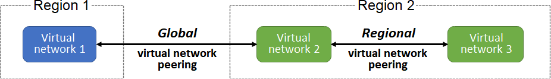
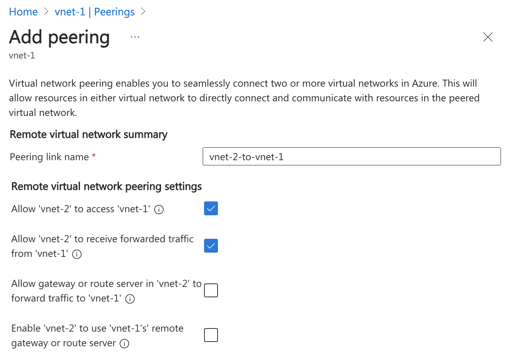

# Virtual Network
[Link] (https://learn.microsoft.com/en-us/azure/virtual-network/virtual-network-peering-overview#service-chaining)

## Subnet
1. Must be specified with CIDR notation. E.g. 10.0.0.2/24
2. All subnet has this default system routes:

Address prefix | Next hop type
--- | ---
Unique to the virtual network | Virtual network
0.0.0.0/0 | Internet
10.0.0.0/8 | None
172.16.0.0/12 | None
192.168.0.0/16 | None
100.64.0.0/10	None

## Reserved IPs
Reserved address | Reason
--- | ---
192.168.1.0 | This value identifies the virtual network address.
192.168.1.1 | Azure configures this address as the default gateway.
192.168.1.2 and 192.168.1.3 | Azure maps these Azure DNS IP addresses to the virtual network space.
192.168.1.255 | This value supplies the virtual network broadcast address.

## Static IP

Static IP addresses don't change and are best for certain situations, such as:

DNS name resolution, where a change in the IP address requires updating host records.
IP address-based security models that require apps or services to have a static IP address.
TLS/SSL certificates linked to an IP address.
Firewall rules that allow or deny traffic by using IP address ranges.
Role-based virtual machines such as Domain Controllers and DNS servers.

## Type of IPs
1. Private IP addresses enable communication within an Azure virtual network and your on-premises network. You create a private IP address for your resource when you use a VPN gateway or Azure ExpressRoute circuit to extend your network to Azure.
2. Public IP addresses allow your resource to communicate with the internet. You can create a public IP address to connect with Azure public-facing services.

## IP address SKU

| SKU | Description |
| --- | --- |
| Basic | Basic SKU public IP addresses are available in a single region only. They're not zone-redundant. You can assign Basic SKU public IP addresses to resources that use Basic SKU load balancers. You can also assign them to resources that use Basic SKU public IP addresses. |
| Standard | Standard SKU public IP addresses are available in a single region only. They're zone-redundant. You can assign Standard SKU public IP addresses to resources that use Standard SKU load balancers. You can also assign them to resources that use Standard SKU public IP addresses. |

## IP address assignment

| Assignment | Description |
| --- | --- |
| Dynamic | Dynamic IP addresses are assigned to resources when they're created. They're not zone-redundant. You can assign dynamic IP addresses to resources that use Basic SKU load balancers. You can also assign them to resources that use Basic SKU public IP addresses. |
| Static | Static IP addresses are assigned to resources when they're created. They're not zone-redundant. You can assign static IP addresses to resources that use Basic SKU load balancers. You can also assign them to resources that use Basic SKU public IP addresses. |

## Network Peering
1. Connect VNet to VNet
2. Regional virtual network peering connects Azure virtual networks that exist in the same region.
3.Global virtual network peering connects Azure virtual networks that exist in different regions.
4. Global peering of virtual networks in different Azure Government cloud regions isn't permitted.
5. Virtual network peering is nontransitive. So A->B->C doesn't mean A->C. Option of using Hub-And-Spoke ($).
6. **Azure Virtual Network Manager ** can be used to view and manage all virtual network peering in a region.

| Benefit | Description |
| --- | --- |
| Private network connections | When you implement Azure Virtual Network peering, network traffic between peered virtual networks is private. Traffic between the virtual networks is kept on the Microsoft Azure backbone network. No public internet, gateways, or encryption is required in the communication between the virtual networks. |
| Strong performance | Because Azure Virtual Network peering utilizes the Azure infrastructure, you gain a low-latency, high-bandwidth connection between resources in different virtual networks. |
| Simplified communication | Azure Virtual Network peering lets resources in one virtual network communicate with resources in a different virtual network, after the virtual networks are peered. |
| Seamless data transfer | You can create an Azure Virtual Network peering configuration to transfer data across Azure subscriptions, deployment models, and across Azure regions. |
| No resource disruptions | Azure Virtual Network peering doesn't require downtime for resources in either virtual network when creating the peering, or after the peering is created. |

| Requirements/Limitations | Description |
| --- | --- |
| Nonoverlapping address spaces | Peered virtual networks must have non-overlapping IP address spaces. Peering creation fails if address ranges overlap. |
| Address space modification restrictions | If you want to change a VNet's address range, you need to delete the peering first, update the address space, and then set up the peering again. |
| Basic Load Balancer limitations | Resources in one VNet can’t communicate with Basic Internal Load Balancer IPs in VNets peered across regions. Use the Standard Load Balancer for cross-region connections. |
| DNS resolution boundaries | Azure's built-in name resolution does not work across peered VNets. Configure Azure Private DNS zones or custom DNS servers for cross-VNet name resolution. |

### Peering Settings

1. A virtual network can have only one VPN gateway.
2. Gateway transit is supported for both regional and global virtual network peering.
3. When you allow VPN gateway transit, the virtual network can communicate to resources outside the peering. In our sample illustration, the gateway subnet gateway within the hub virtual network can complete tasks such as:
    - Use a site-to-site VPN to connect to an on-premises network.
    - Use a vnet-to-vnet connection to another virtual network.
    - Use a point-to-site VPN to connect to a client.
4. Gateway transit allows peered virtual networks to share the gateway and get access to external resources. With this implementation, you don't need to deploy a VPN gateway in the peered virtual network.
5. You can apply network security groups in a virtual network to block or allow access to other virtual networks or subnets. When you configure virtual network peering, you can choose to open or close the network security group rules between the virtual networks.
6. Only ** Network Contributor** RBAC role can create virtual network peering.

### Status
Initiated -> Connected

## Traffice Routing
1. Service Chaining - is a method used to direct traffic from one virtual network to a virtual appliance or gateway. It involves defining a user-defined route that specifies the peered networks, allowing for flexible traffic management. User-defined routes (UDRs) enable you to specify the next hop for traffic, which can be the IP address of a virtual machine in a peered virtual network or a VPN gateway. 
2. UDR - are crucial for managing traffic in a virtual network. They allow you to define the next hop for traffic, which can be directed to a virtual machine or a VPN gateway in a peered network. Service chaining complements this by enabling traffic to flow through designated appliances, enhancing the network’s capabilities. Together, these mechanisms facilitate a multi-level hub and spoke architecture, allowing for better resource management and connectivity between virtual networks. Service tags can be used in UDRs.
3. Virtual Application - often referred to as a network virtual appliance (NVA), is a virtual machine that performs specific network functions such as firewalls, WAN optimization, or other network services. These appliances can be integrated into Azure virtual networks to enhance network capabilities and manage traffic effectively. [NVA](https://learn.microsoft.com/en-us/training/modules/control-network-traffic-flow-with-routes/4-network-virtual-appliances)
4. Gateway Transit - allows peered spoke VNets to share a single VPN or ExpressRoute gateway in a hub VNet, rather than deploying gateways in every VNet. It simplifies network management, reduces costs, and enables transitive connectivity between on-premises and all connected virtual networks. This is also a Hub-And-Spoke.
5. Virtual Network Gateway - use to indicate when you want routes for a specific address to be routed to a virtual network gateway. It is used to send encrypted traffic between Azure and on-premises over the internet and to send encrypted traffic between Azure networks. A virtual network gateway contains routing tables and gateway services.

6. Service endpoint - extend your private address space in Azure by providing a direct connection to your Azure resources. This connection restricts the flow of traffic: your Azure virtual machines can access your storage account directly from the private address space and deny access from a public virtual machine. Uses Azure backbone. This is free compared to private endpoint.
7. Private endpoint - Private endpoints provide a dedicated private IP address accessible only within a specific virtual network, whereas service endpoints use public IP addresses. 
8. Border Gateway Protocol (BGP) - A network gateway in your on-premises network can exchange routes with a virtual network gateway in Azure by using BGP. 

## Route selection and priority
1. If multiple routes are available in a route table, Azure uses the route with the longest prefix match. For example, a message is sent to the IP address 10.0.0.2, but two routes are available with the 10.0.0.0/16 and 10.0.0.0/24 prefixes. Azure selects the route with the 10.0.0.0/24 prefix because it's more specific.
2. The longer the route prefix, the shorter the list of IP addresses available through that prefix. When you use longer prefixes, the routing algorithm can select the intended address more quickly.
3. You can't configure multiple user-defined routes with the same address prefix.
4. If there are multiple routes with the same address prefix, Azure selects the route based on the type in the following order of priority:
    - User-defined routes
    - BGP routes
    - System routes