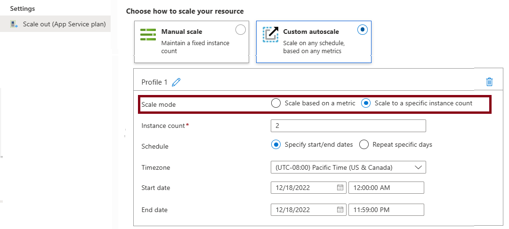

# Web Application
[Web App](https://learn.microsoft.com/en-us/azure/app-service/)

## App Service Plan
An App Service plan defines a set of compute resources for a web application to run.
An App Service = Azure Server WebFarms, if you park anything under Microsoft.Web/serverFarms it ties to this.

| Feature | Description |
| --- | --- |
| **App Service Plan** | Determines the compute resources (CPU, RAM, storage) allocated to your web app. |
| **Pricing Tier** | Defines the features and performance level of your app (e.g., Free, Shared, Basic, Standard, Premium, Isolated). |
| **Instance Size** | Specifies the CPU and memory resources available to each instance of your app. |
| **Instance Count** | The number of VM instances running your app. Can be scaled manually or automatically. |
| **Scale-Out** | Automatically adds more instances when traffic increases. |
| **Scale-In** | Automatically removes instances when traffic decreases. |
| **Autoscale Settings** | Configure rules for automatic scaling based on metrics like CPU usage, memory usage, or request count. |
| **Deployment Slots** | Create separate environments (e.g., staging, production) for testing and deploying changes without affecting the live site. |
| **Custom Domains** | Map your own domain name to your web app. |
| **SSL/TLS Certificates** | Secure your app with SSL/TLS certificates. |
| **VNet Integration** | Connect your app to a virtual network for secure access to private resources. |
| **Private Endpoints** | Provide private access to your app from within a virtual network. |
| **Application Insights** | Monitor your app's performance and usage. |
| **Azure Backup** | Back up your app's configuration and content. |
| **Azure Advisor** | Get recommendations for optimizing your app's performance and cost. |
| **Azure Policy** | Enforce organizational standards and assess compliance. |
| **Azure Role-Based Access Control (RBAC)** | Control access to your app resources. |
| **Azure Disk Encryption** | Encrypt your app's data at rest. |
| **Azure Security Center** | Provides security management and threat protection. |
| **Azure Advisor** | Provides recommendations for optimizing your app's performance and cost. |
| **Azure Policy** | Enforces organizational standards and assesses compliance. |
| **Azure Role-Based Access Control (RBAC)** | Controls access to your app resources. |
| **Azure Disk Encryption** | Encrypts your app's data at rest. |
| **Azure Security Center** | Provides security management and threat protection. |

## Pricing Tier

| Tier | Description |
| --- | --- |
| **Free** | Limited features and performance. These tiers are intended to be used for development and testing purposes only. No SLA is provided for the Free and Shared service plans. |
| **Shared** | Shared resources with other apps. Same as Free, no SLA. |
| **Basic** | Dedicated resources with basic features.  Built-in network load-balancing support automatically distributes traffic across instances. The Basic service plan with Linux runtime environments supports Web App for Containers.|
| **Standard** | Dedicated resources with advanced features. The Standard service plan with Linux runtime environments supports Web App for Containers. Built-in network load-balancing support automatically distributes traffic across instances. |
| **Premium** | High-performance dedicated resources with advanced features. Offering Dav4 and Ddv4-series virtual machines and SSD storage. |
| **Isolated** | Dedicated resources in a private network with advanced features. IsolatedV2 is the preferred tier offering newer hardware, up to 200 instances, private environments, and enhanced security. |

| Feature | Free F1 | Basic B1 | Standard S1 | Premium P1V3 | Isolated V2 |
| --- | --- | --- | --- | --- | --- |
| Usage | Development, Testing | Development, Testing | Production workloads | Enhanced scale, performance | Network-isolated workloads |
| Staging slots | N/A | N/A | 5 | 20 | 20 |
| Auto scale | N/A | Manual | Rules | Rules, Elastic | Rules |
| Scale instances | N/A | 3 | 10 | 30 | 200 |
| Daily backups | N/A | N/A | 10 | 50 | 50 |

## Tier Scaling
Your App Service plan can be scaled up and down at any time by changing the pricing tier of the plan.

## AutoScale (Rule base)
Only available on Standard, Premium, and Isolated tiers.

Metric-based rules measure application load and add or remove virtual machines based on the load, such as "do this action when CPU usage is above 50%." Example metrics include CPU time, Average response time, and Requests.

Time-based rules (or, schedule-based) allow you to scale when you see time patterns in your load and want to scale before a possible load increase or decrease occurs. An example is "trigger a webhook every 8:00 AM on Saturday in a given time zone."

### Elastic Autoscale
Azure App Service offers Automatic scaling (also called Elastic scaling) for PremiumV2 and PremiumV3 tiers. This is a separate scaling feature that works differently from the autoscale rules.

HTTP traffic-based. Automatic scaling responds directly to incoming HTTP requests without requiring you to configure scaling rules.

Platform-managed. Azure automatically manages the scaling decisions based on traffic patterns, eliminating the need for rule configuration.

Always-ready instances. Maintains warmed instances to handle traffic spikes immediately.

Tier availability. Available only on PremiumV2 and PremiumV3 tiers.

## Deployment Slots
1. Standard and above tiers support deployment slots.
2. Used to stage and test new versions of an app before swapping them into production. [Deployment slots](https://learn.microsoft.com/en-us/azure/app-service/deploy-staging-slots?tabs=portal)